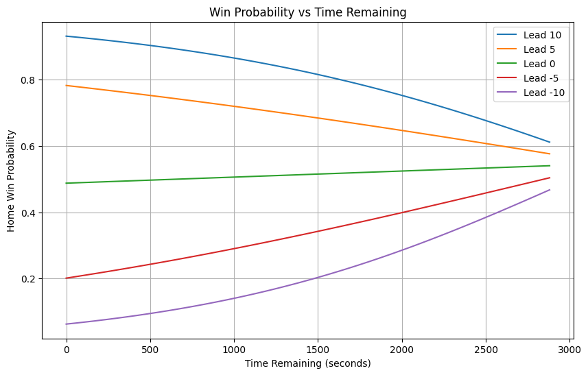

# NBA Win Probability Model

A machine learning project that estimates the probability of the home team winning an NBA game using play-by-play data.

## Overview

This project uses NBA play-by-play events to predict the eventual winner of a game based on the current game state.

The initial goal was to build a simple baseline model and then investigate whether better feature engineering or more complex models led to better performance.

---

## Dataset

- NBA 2024 Play-by-Play Data
- ~640,000 recorded events
- 1,300+ games
- Features extracted from scoring events only

Raw play-by-play data was transformed into game-state snapshots for machine learning.

---

## Feature Engineering

Current features:

- Score Differential
- Game Seconds Remaining
- Interaction Feature
    - `score_diff × game_seconds_remaining`

Special preprocessing steps:

- Converted NBA clock strings into seconds.
- Removed overtime rows while preserving the final game result.
- Split train/test sets by game ID to prevent data leakage.

---

## Models Tested

| Model | Features | Accuracy |
|--------|----------|-----------|
| Logistic Regression | Score Differential + Time Remaining | 76.13% |
| Logistic Regression | + Interaction Feature | **76.62%** |
| Random Forest | Same Features | 69.74% |

---

## Key Findings

- Score differential and time remaining are strong predictors of game outcomes.
- Interaction features helped the model better understand the value of late-game leads.
- Splitting by game rather than individual rows was necessary to avoid data leakage.
- A more complex Random Forest model performed worse than Logistic Regression, suggesting that NBA win probability changes relatively smoothly rather than through sharp decision boundaries.

---

## Future Improvements

- Team ELO Ratings
- Possession Tracking
- Player Availability
- Injury Information
- Additional model comparisons

---

## Sample Visualization

---

## Technologies Used

- Python
- Pandas
- NumPy
- Scikit-learn
- Matplotlib
- Jupyter Notebook
